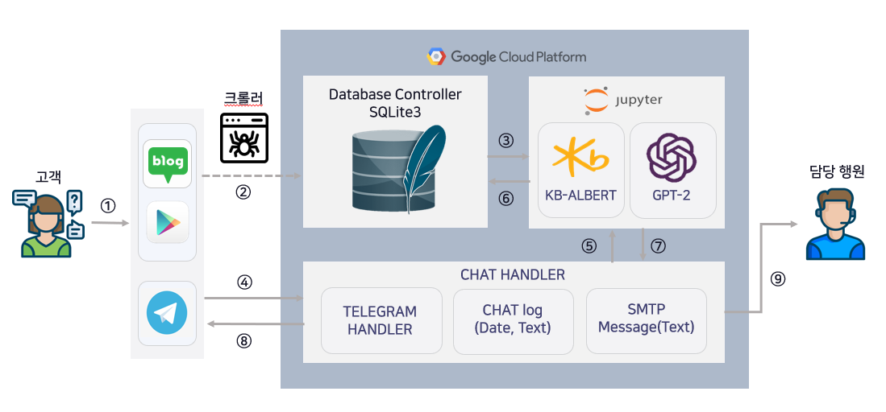
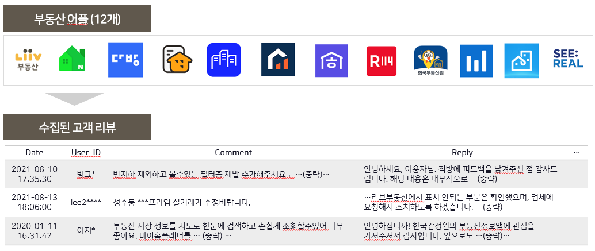
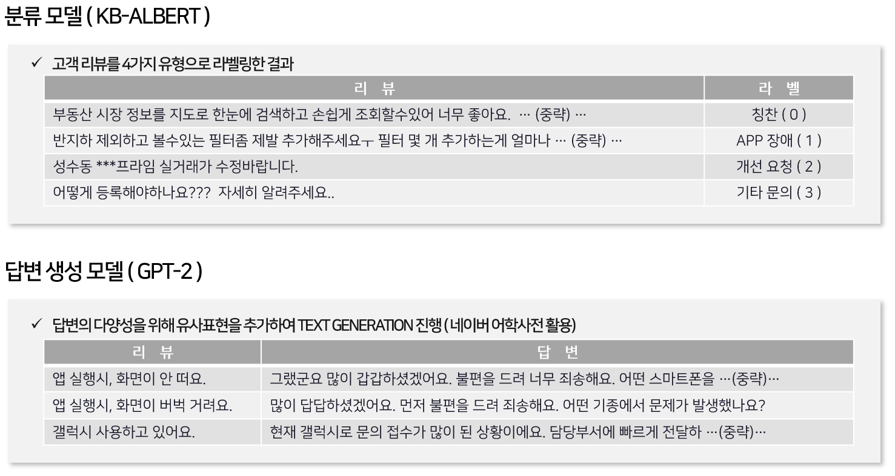
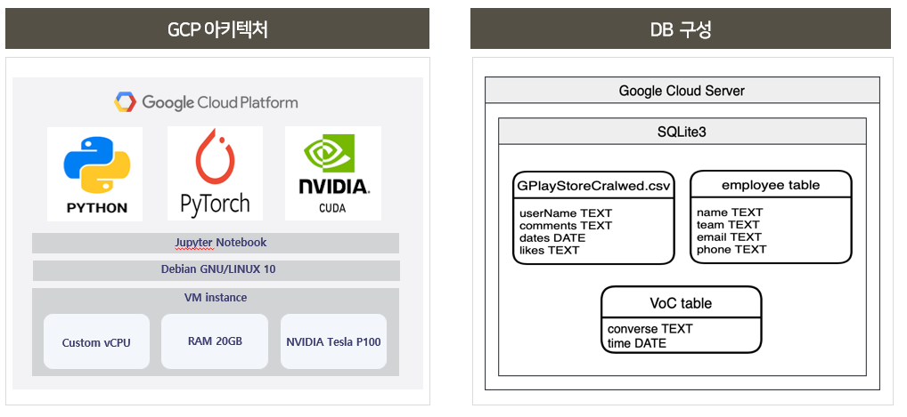
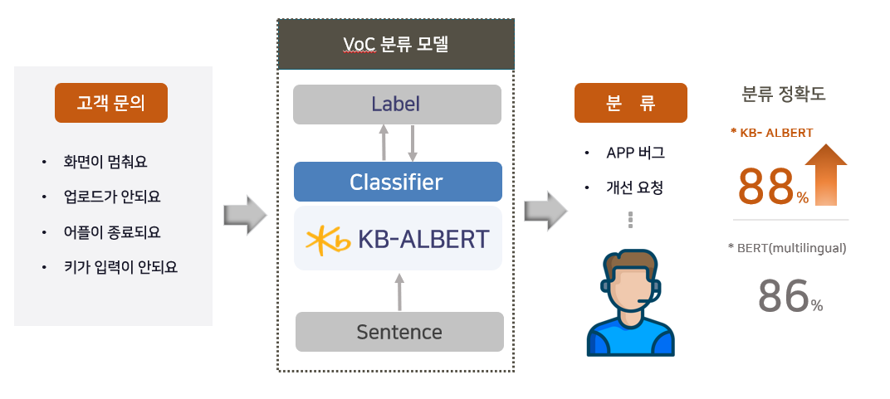
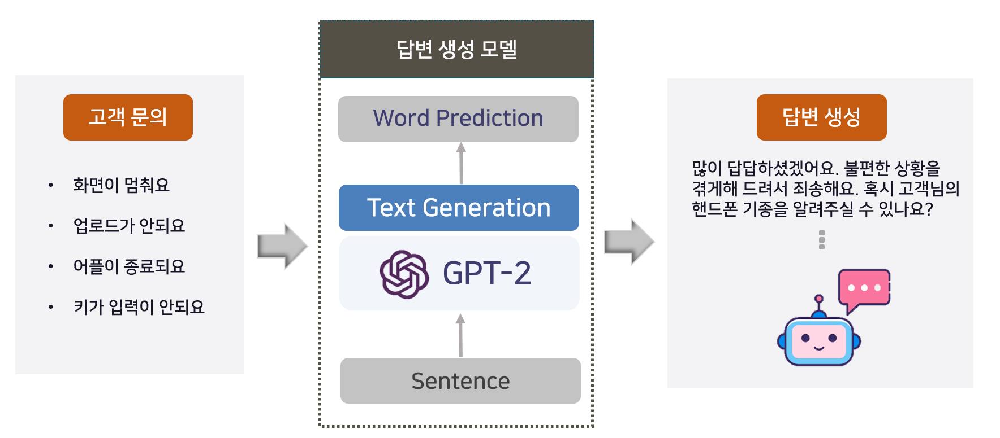

# 한국어 PLM 모델을 탑재한 원스톱 챗봇 서비스

## 개요
12개의 부동산 서비스에서 10년간의 VoC를 수집하고  
이를 KB-ALBERT와 KoGPT-2에 학습시켜 고객의 말을 잘 이해하며 자연스러운 응대가 가능한 원스톱 챗봇 서비스 개발

## 서비스 목적
금융 서비스의 VoC 관리에서 나타나는 4가지 문제를 AI 기술을 적용하여 해결하고 효율적인 VoC 관리를 통한 고객 서비스 만족도 향상
  - ① 복잡한 절차 ② 느린 답변 시간 ③ 기계적인 답변 ④ 담당자 재분류로 인한 문의처리 리드타임 지연

## 프로젝트 기간 
2021.09.03 ~ 2022.10.26

## 개발 인원
총 2명 (AI 개발자 1명, 백엔드 개발자 1명)

## 사용기술
- Language : Python 3.8, Pytorch, Mysql  
- DB : SQLite3  
- Infra : Google Cloud Platform  
- API : Telegram Bot API

## 수행역할 
- LiivBERT Team Leader
- KB-ALBERT & KoGPT-2 fine-tuning
- 자연어 처리 모델 학습 데이터셋 구성
- GCP를 활용한 개발환경 구축
- Telegram Bot API를 활용해 고객에게 자연스로운 메세지를 전달할 수 있는 챗봇 개발 
- Future Finance A.I. Challenge 발표 진행

## 아키텍쳐  
### 한국어 PLM 모델을 탑재한 챗봇 구조

- 구글 플레이스토어와 네이버 블로그에서 12개의 부동산 서비스에 대한 고객의 VoC 수집
- 수집된 VoC를 SQLite3에 저장하고 두 언어모델에 전달
- Telegram Bot API를 통해 고객의 문의를 입력받고 두 언어모델의 inference 진행
- KB-ALBERT는 고객의 문의가 어떤 유형에 속하는지 분류하는 task 수행
- 고객의 질문 당 6,500개의 문답 페어셋을 학습한 KoGPT-2는 자연스러운 답변을 생성하는 task 수행  

## 개발 과정

### 1. 데이터 수집
#### 크롤러를 통해 구글 플레이스토어와 네이버 블로그에서 12개의 부동산 서비스에 대한 고객의 Voc 수집 

- 수집된 데이터에서 Date, User_Id, Comment, Reply 정보를 파싱하여 저장

### 2. 언어모델 학습 데이터셋
#### 분류 모델(KB-ALBERT)와 답변생성 모델(KoGPT-2)의 학습을 위한 데이터셋 구성  

### 3. GCP 아키텍처 & DB 구성
#### 실제 서비스와 유사하도록 개발 환경 구축  

### 4. KB-ABLERT
#### 고객의 문의(TEXT)를 4가지 카테고리로 분류하는 Task 수행  

### 5. KoGPT-2
#### 고객의 문의(TEXT)에 대한 자연스러운 답변을 생성하는  Task 수행  

## 프로젝트 결과 
### LiivBERT의 고객 응대 시뮬레이션

